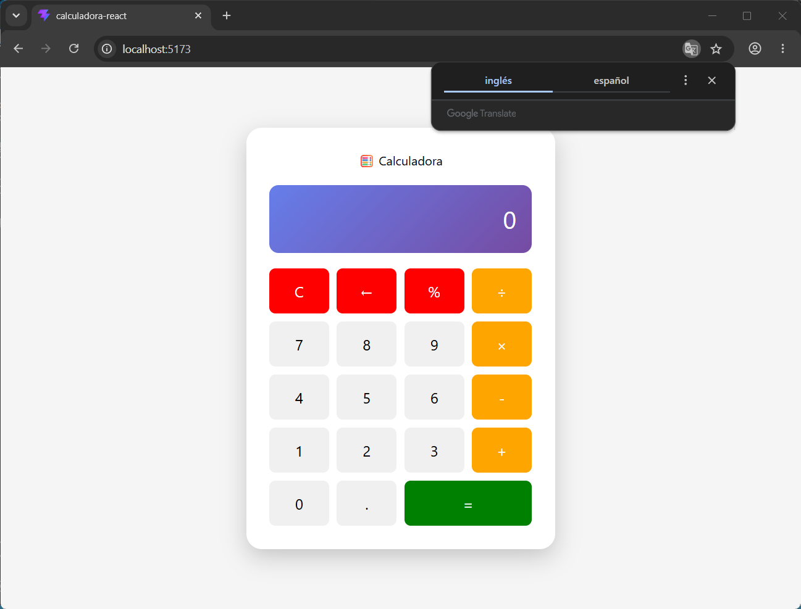

# Practica2_DispositivosMoviles1
# DESARROLLO DE CALCULADORA CON REACT TYPESCRIPT Y TAILWINDCSS

## Descripción de la práctica

Se realizó el desarrollo de una aplicación de Calculadora funcional utilizando React con TypeScript, aplicando conceptos de componentes, hooks ( useState , useEffect ) y estilos con TailwindCSS y CSS personalizados.

Estudiante: Walter Antonio Machaca Anze

Carrera: Sistemas informáticos

## Captura Calculadora
